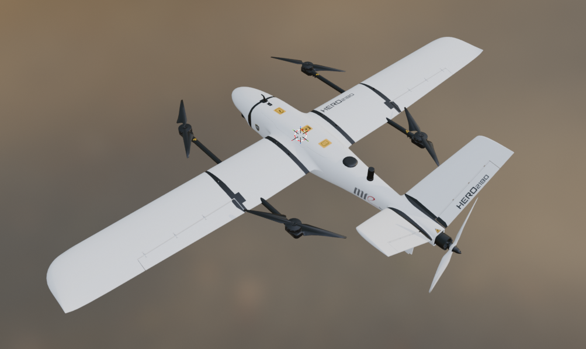

# Hero VTOL

## Characteristics

* Wing span: .......... 2.18 m
* Length: ............. 1.14 m
* Weight: ............. 7.00 kg
* Battery: ............ 6SLiPo - 22000 mAh
* Cruise Power: ....  MFE 3520 kv500 ESC6100 APC1510
* Rotor Power: .......MFE 4112 kv460 ESC650  MFE1550 

## Ardupilot servo functions
* Servo 1        Aileron Left
* Servo 2        VTail Left
* Servo 3        Throttle
* Servo 4        VTail Right
* Servo 5        Aileron Right
* Servo 6        
* Servo 7       
* Servo 8       
* Servo 9        Motor 1
* Servo 10       Motor 2
* Servo 11       Motor 3
* Servo 12       Motor 4

## Ardupilot Mode Configuration

* FLTMODE_CH,8
* FLTMODE1,17
* FLTMODE2,19
* FLTMODE3,19
* FLTMODE4,19
* FLTMODE5,19
* FLTMODE6,5

##RC Output Channel Configuration
* Aileron   Ch1
* Elevator  Ch2
* Throttle  Ch3
* Rudder    Ch4
* SwA       Ch7
* SwB       Ch8 (always mode)
* SwC       Ch5
* SwD       Ch6

## Notes
* Models of QuadPlanes for ArduPilot SITL in Realflight8
* Tested in RealFlight Evolution using ArduPlane 4.4.4

